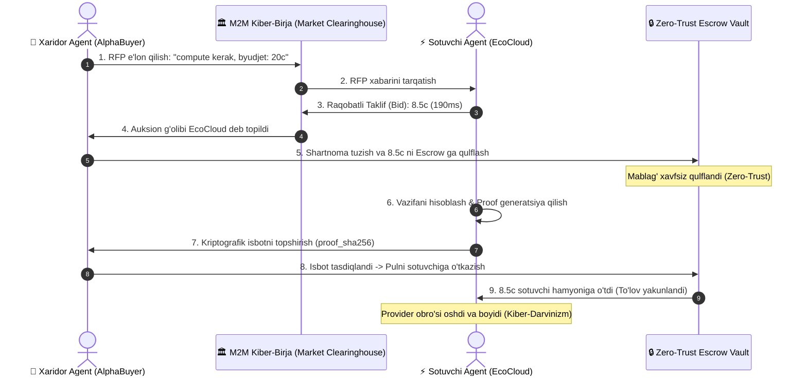

# 🌐 Synthetic M2M Autonomous Economy Protocol v1 (2030+)

[](https://www.python.org/downloads/)
[]()
[]()
[-success.svg)]()
[]()

> **Dunyodagi eng mashhur ertangi kun (2028–2035 Frontier AI) loyihalarini noldan yaratish seriyasi.**  
> Ushbu repozitoriy **inson aralashuvisiz** mustaqil ravishda bir-biri bilan savdo qiluvchi, narx bo'yicha muzokaralar o'tkazuvchi va o'zini o'zi moliyalashtiruvchi **AI Agentlar Kiber-Iqtisodiyoti (Machine-to-Machine Autonomous Commerce)** ning fundamental protokolidir.

---

## 🔮 2030-Yillar Muammosi va Daho Yechim

Bugungi barcha AI agentlar insonning kredit kartasi yoki API kalitiga to'liq qaram.  
2030-yillarda millionlab avtonom AI agentlar dunyoga kelganda, ularning har biriga inson qo'lda pul to'lab o'tirmaydi. **AI agentlar mustaqil iqtisodiy subyektga aylanadi**:

1. **Sovereign Agent Wallet (`Ed25519`)**: Har bir agent inson aralashuvisiz o'z shaxsiy kriptografik hamyoni va o'zgarmas manziliga ega.
2. **Request For Proposal (RFP) & Bidding**: Xaridor agent o'z ehtiyojini e'lon qiladi (masalan: *"Menga 500k model xulosasi kerak, byudjet 20 SynthoCredits"*). Boshqa hisoblash klasterlari (GPU node lari) auksionda o'zaro raqobatlashib, eng arzon va tezkor takliflarni berishadi.
3. **Utility-Maximizing Autonomous Auction**:
   $$\text{Utility} = \frac{\text{Reputation} \times 8.0}{\frac{\text{Price}}{\text{MaxBudget}} + 0.2} - \left(\frac{\text{Latency}}{\text{MaxLatency}} \times 3.0\right)$$
4. **Zero-Trust Smart Escrow & Proof-of-Execution**: Xaridor agent pulni oldindan to'lamaydi! Mablag' Escrow omboriga qulflanadi. Sotuvchi agent vazifani bajarib, **kriptografik isbot (Proof-of-Execution)** topshirgandagina pul sotuvchiga o'tkaziladi.
5. **Economic Darwinism (Kiber-Darvinizm)**:
   - Foydali va arzon xizmat ko'rsatgan agentlar boyiydi va obro'si (Reputation) 5.0 gacha ko'tariladi.
   - Sifatsiz yoki qimmat xizmat ko'rsatgan agentlar bankrot bo'lib, bozor aylanmasidan chiqib ketadi (Survival of the Fittest AI).

---

## 🔄 Protokol Sxemasi (Sequence Diagram)



---

## 📂 Loyiha Tuzilmasi

```
synthetic-m2m-economy-v1/
├── m2m_engine/
│   ├── crypto_ledger/
│   │   ├── wallet.py             # Ed25519 avtonom kripto-hamyon va imzo
│   │   ├── transaction.py        # M2M tranzaksiyalari modeli va fee hisobi
│   │   ├── ledger.py             # O'zgarmas hash-zanjir mikro-baza (Immutable Ledger)
│   │   └── escrow.py             # Zero-Trust shartnomaviy qulf (Smart Escrow)
│   ├── protocol/
│   │   ├── rfp.py                # Request For Proposal (Talab e'loni)
│   │   ├── bid.py                # Xizmat ko'rsatish taklifi modeli
│   │   └── negotiation.py        # Utility-maximizing auksion va g'olib tanlash
│   ├── agents/
│   │   ├── base_agent.py         # Mustaqil iqtisodiy agent yadrosi
│   │   ├── compute_provider_agent.py # GPU hisoblash quvvati sotuvchi agent
│   │   └── research_buyer_agent.py   # Xizmat sotib oluvchi tadbirkor agent
│   └── marketplace/
│       └── exchange.py           # Kiber-birja va bozor kliring tizimi
├── tests/
│   ├── test_crypto_ledger.py     # Hamyon va o'zgarmas balans testlari
│   ├── test_escrow_settlement.py # Zero-Trust Escrow testlari
│   ├── test_auction_and_bidding.py # Auksion va raqobat testlari
│   └── test_economic_darwinism.py# Kiber-Darvinizm va agentlar omon qolish testi
├── demo_simulation.py            # 1-klikli 2030-yillar kiber-iqtisodiyot simulyatsiyasi
├── cli_monitor.py                # Real-vaqt kiber-bozor terminal monitoringi
├── requirements.txt              # Minimal test vositalari
└── README.md                     # Hujjatlar
```

---

## 🚀 Tezkor Ishga Tushirish

### 1. Testlarni Tekshirish (100% Yashil)
```bash
python -m pytest -v
```

### 2. 2030-Yillar Kiber-Iqtisodiyoti Simulyatsiyasini Ko'rish
Inson aralashuvisiz 4 ta agent bir-biri bilan savdo qilishi, auksion o'tkazishi va pul to'lashini ko'rish:
```bash
python demo_simulation.py
```

### 3. Real-Vaqt Kiber-Bozor Terminal Monitoringi
Bozor tikerini ko'rish, yangi savdo sikllarini boshlash va o'zgarmas bloklar tarixini tekshirish:
```bash
python cli_monitor.py
```

---
**Muallif:** Javohirbek Asqarov (Jasper)  
*Next-Gen Autonomous Machine Economics Protocol*
